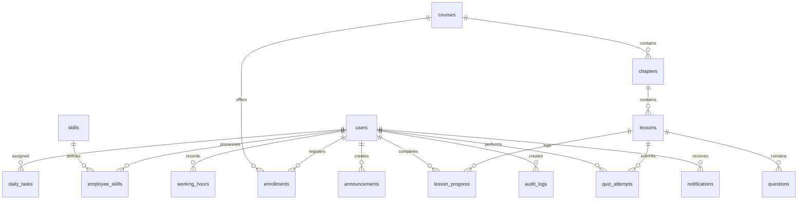

# ระบบบริหารจัดการการฝึกอบรมและทักษะของพนักงานคลังสินค้า (Warehouse Training & Skill Management System)

เว็บแอปพลิเคชันระดับองค์กร (Enterprise Web Application) สำหรับการจัดการการฝึกอบรมและทักษะของพนักงานคลังสินค้า ออกแบบมาเพื่อให้รองรับความต้องการสำหรับคลังสินค้าสมัยใหม่

## ฟังก์ชันการทำงานตามบทบาทผู้ใช้ (User Roles)
1. **Super Admin**: จัดการผู้ใช้งาน ระบบหลังบ้าน สำรองข้อมูล และตรวจสอบ Audit Logs ทั่วทั้งระบบ
2. **HR**: จัดการข้อมูลพนักงาน (CRUD) นำเข้า/ส่งออกพนักงานผ่าน Excel และเรียกดูประวัติสถิติรวม
3. **Trainer**: สร้างหลักสูตรบทเรียน สื่อการสอน (วิดีโอ YouTube/MP4, เอกสาร PDF) และจัดการระบบข้อสอบ (Quiz System)
4. **Supervisor**: มอบหมายบทเรียน อนุมัติความถูกต้องของการสอบ/ทักษะ (Skill Matrix) และมอบหมายงานปฏิบัติการประจำวัน (Daily Tasks)
5. **Employee**: เข้าเรียนผ่านห้องเรียนจำลอง ทำข้อสอบสะสมคะแนน ลงเวลาเข้า-ออกงาน (Clock In/Out) และประเมิน KPI

---

## สถาปัตยกรรมข้อมูล (ER Diagram)



---

## โครงสร้างโฟลเดอร์ของโครงการ (Folder Structure)

```text
├── database/
│   ├── schema.sql         # PostgreSQL Schema ตารางความสัมพันธ์และดัชนี
│   └── seeds.sql          # ข้อมูลพนักงาน ทักษะ คอร์ส และข้อสอบจำลองเริ่มต้น
│
├── backend/
│   ├── src/
│   │   ├── config/        # การเชื่อมต่อฐานข้อมูลและข้อมูลสำรอง (db.ts, mockData.ts)
│   │   ├── middleware/    # ตรวจสอบสิทธิ์เข้าถึง (auth.ts)
│   │   ├── routes/        # บริการ API (auth.ts, employees.ts, skills.ts, courses.ts, tasks.ts, attendance.ts, reports.ts)
│   │   └── index.ts       # จุดรันเซิร์ฟเวอร์หลักและระบุ Swagger
│   ├── Dockerfile
│   ├── tsconfig.json
│   └── package.json
│
├── frontend/
│   ├── src/
│   │   ├── app/           # หน้าเว็บ Next.js (layout, dashboard, login, employees, skills, courses, tasks, hours, performance, reports, admin)
│   │   ├── components/    # คอมโพเนนต์ UI (GlassCard.tsx, Sidebar.tsx, Navbar.tsx)
│   │   └── context/       # เก็บสถานะ (ThemeContext.tsx, AuthContext.tsx)
│   ├── tailwind.config.js
│   ├── postcss.config.js
│   ├── Dockerfile
│   ├── tsconfig.json
│   └── package.json
│
├── docker-compose.yml     # รัน PostgreSQL, pgAdmin, Backend และ Frontend ผ่าน Docker Container
├── .env.example           # ไฟล์กำหนดตัวแปรสภาพแวดล้อมจำลอง
└── README.md              # เอกสารอธิบายการติดตั้งและคู่มือใช้งาน
```

---

## ขั้นตอนการติดตั้งและรันระบบ (Setup & Running Guide)

### วิธีที่ 1: รันแบบเร็วที่สุดด้วย Docker Compose (แนะนำ)
ต้องการเพียงติดตั้ง Docker บนเครื่อง และรันคำสั่งเดียวยกทั้งระบบ:

```bash
# โคลนและเปิดโปรเจกต์
# รันระบบทั้งหมด
docker-compose up --build
```
ระบบจะเปิดพอร์ตดังนี้:
- **Frontend App**: `http://localhost:3000`
- **Backend API**: `http://localhost:5000`
- **Swagger Docs**: `http://localhost:5000/api-docs`
- **pgAdmin**: `http://localhost:5050` (Email: `admin@warehouse.com` | Password: `adminpassword`)

---

### วิธีที่ 2: รันแบบแมนนวลในเครื่องคอมพิวเตอร์ (Local Development)

#### 1. การเตรียมฐานข้อมูล (Database)
1. ติดตั้งและเปิดรัน PostgreSQL บนเครื่องคอมพิวเตอร์
2. สร้างฐานข้อมูลชื่อ `warehouse_db`
3. รันสคริปต์ SQL จาก `database/schema.sql` และตามด้วย `database/seeds.sql` เพื่อป้อนข้อมูลจำลอง

#### 2. รันส่วนหลังบ้าน (Backend API)
```bash
cd backend
# ติดตั้ง dependencies
npm install
# รันเซิร์ฟเวอร์ในโหมด Developer (nodemon)
npm run dev
```
*หมายเหตุ: ตั้งค่าความเชื่อมโยงในไฟล์ `.env` (ดูได้จากตัวอย่าง `.env.example`)*

#### 3. รันส่วนหน้าบ้าน (Frontend UI)
```bash
cd frontend
# ติดตั้ง dependencies
npm install
# รันเซิร์ฟเวอร์ Next.js ในหน้าเว็บพัฒนา
npm run dev
```
เปิดบราวเซอร์เพื่อเข้าไปที่: `http://localhost:3000`

---

## โหมดทดสอบสำหรับผู้ตรวจประเมิน (Demo Evaluation Switcher)
เพื่อความสะดวกในการประเมินการออกแบบ UI และสิทธิ์การเข้าใช้งานของทั้ง 5 บทบาท:
1. ที่หน้าจอเข้าสู่ระบบ (Login) คุณสามารถคลิกปุ่ม **Quick Logins** ที่ด้านล่าง หรือกรอกรหัสผ่าน `password123`
2. เมื่อเข้าสู่ระบบแล้ว คุณสามารถใช้เมนู **"สลับบทบาท (Demo Role)"** บนแถบด้านบนของหน้าเว็บ (Navbar) เพื่อเปลี่ยนบทบาทจำลองระหว่าง Super Admin, HR, Trainer, Supervisor และ Employee ได้ทันที ระบบจะอัปเดตเมนูและหน้า Dashboard ให้แสดงตามสิทธิ์จริงอัตโนมัติโดยไม่ต้องล็อกเอ้าท์และล็อกอินใหม่
