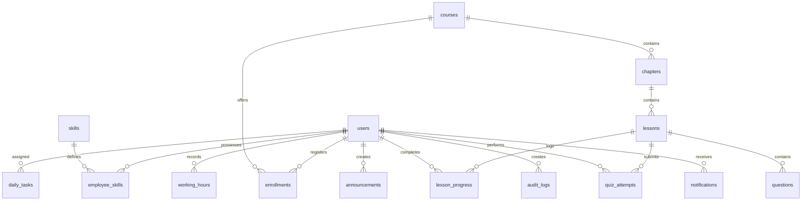

# ระบบบริหารจัดการการฝึกอบรมและทักษะของพนักงานคลังสินค้า (Warehouse Training & Skill Management System)

เว็บแอปพลิเคชันระดับองค์กร (Enterprise Web Application) สำหรับการจัดการการฝึกอบรมและทักษะของพนักงานคลังสินค้า ออกแบบมาเพื่อให้รองรับความต้องการสำหรับคลังสินค้าสมัยใหม่

## ฟังก์ชันการทำงานตามบทบาทผู้ใช้ (User Roles)
1. **Super Admin**: จัดการผู้ใช้งาน ระบบหลังบ้าน สำรองข้อมูล และตรวจสอบ Audit Logs ทั่วทั้งระบบ
2. **HR**: จัดการข้อมูลพนักงาน (CRUD) นำเข้า/ส่งออกพนักงานผ่าน Excel และเรียกดูประวัติสถิติรวม
3. **Trainer**: สร้างหลักสูตรบทเรียน สื่อการสอน (วิดีโอ YouTube/MP4, เอกสาร PDF) และจัดการระบบข้อสอบ (Quiz System)
4. **Supervisor**: มอบหมายบทเรียน อนุมัติความถูกต้องของการสอบ/ทักษะ (Skill Matrix) และมอบหมายงานปฏิบัติการประจำวัน (Daily Tasks)
5. **Employee**: เข้าเรียนผ่านห้องเรียนจำลอง ทำข้อสอบสะสมคะแนน ลงเวลาเข้า-ออกงาน (Clock In/Out) และประเมิน KPI

---

## สถาปัตยกรรมข้อมูล (ER Diagram)


```mermaid
erDiagram
    users ||--o{ employee_skills : "possesses"
    skills ||--o{ employee_skills : "defines"
    users ||--o{ enrollments : "registers"
    courses ||--o{ enrollments : "offers"
    courses ||--o{ chapters : "contains"
    chapters ||--o{ lessons : "contains"
    lessons ||--o{ lesson_progress : "logs"
    users ||--o{ lesson_progress : "completes"
    lessons ||--o{ questions : "contains"
    lessons ||--o{ quiz_attempts : "submits"
    users ||--o{ quiz_attempts : "performs"
    users ||--o{ daily_tasks : "assigned"
    users ||--o{ working_hours : "records"
    users ||--o{ announcements : "creates"
    users ||--o{ audit_logs : "creates"
    users ||--o{ notifications : "receives"
```

---

## โครงสร้างโฟลเดอร์ของโครงการ (Folder Structure)

```text
├── database/
│   ├── schema_mysql.sql   # MySQL 8.0 / MariaDB Schema และข้อมูลเริ่มต้น (ครบถ้วนสมบูรณ์)
│   └── schema.sql         # PostgreSQL Schema ตารางความสัมพันธ์
│
├── backend/
│   ├── src/
│   │   ├── config/        # การเชื่อมต่อฐานข้อมูล (db.ts, mysqlInit.ts, mockData.ts)
│   │   ├── middleware/    # ตรวจสอบสิทธิ์เข้าถึง (auth.ts)
│   │   ├── routes/        # บริการ API (auth, employees, skills, courses, tasks, attendance, reports, layouts, ฯลฯ)
│   │   └── index.ts       # จุดรันเซิร์ฟเวอร์หลักและระบุ Swagger
│   ├── Dockerfile
│   ├── tsconfig.json
│   └── package.json
│
├── frontend/
│   ├── src/
│   │   ├── app/           # หน้าเว็บ Next.js 14 App Router
│   │   ├── components/    # คอมโพเนนต์ UI (GlassCard, Sidebar, Navbar, ฯลฯ)
│   │   └── context/       # เก็บสถานะ (ThemeContext, AuthContext)
│   ├── nginx.conf         # การตั้งค่า Nginx สำหรับ Static Production Container
│   ├── Dockerfile         # Multi-stage Nginx Alpine Container
│   ├── tsconfig.json
│   └── package.json
│
├── docker-compose.yml     # รัน MySQL 8, phpMyAdmin, Backend API และ Frontend UI
├── IT_DEPLOYMENT_GUIDE.md # เอกสารคู่มือการติดตั้งและส่งมอบระบบขึ้น Cloud สำหรับฝ่าย IT
├── package_for_it.bat     # สคริปต์บีบอัดไฟล์ Source Code สะอาดสำหรับส่งมอบ IT
├── .env.example           # ไฟล์กำหนดตัวแปรสภาพแวดล้อมจำลอง
└── README.md              # เอกสารอธิบายการติดตั้งและคู่มือใช้งาน
```

---

## เอกสารการส่งมอบและติดตั้งขึ้น Cloud (Cloud & IT Deployment)
> สำหรับฝ่าย IT / DevOps / Cloud Engineer โปรดดูคู่มือฉบับเต็มอย่างละเอียดได้ที่: **[IT_DEPLOYMENT_GUIDE.md](file:///c:/Users/chatn/OneDrive/Desktop/Leaning/IT_DEPLOYMENT_GUIDE.md)**

---

## ขั้นตอนการติดตั้งและรันระบบ (Setup & Running Guide)

### วิธีที่ 1: รันผ่าน Docker Compose (แนะนำ)
ต้องการเพียงติดตั้ง Docker บนเครื่อง และรันคำสั่งเดียวยกทั้งระบบ:

```bash
# รันระบบทั้งหมด (MySQL 8, phpMyAdmin, Backend, Frontend)
docker compose up -d --build
```
ระบบจะเปิดพอร์ตดังนี้:
- **Frontend App**: `http://localhost:3000`
- **Backend API**: `http://localhost:5000`
- **Swagger Docs**: `http://localhost:5000/api-docs`
- **phpMyAdmin**: `http://localhost:8080` (User: `root` | Password: `rootpassword`)

---

### วิธีที่ 2: รันแบบแมนนวลในเครื่องคอมพิวเตอร์ (Local Development)

#### 1. การเตรียมฐานข้อมูล (MySQL Database)
1. ติดตั้งและเปิดรัน MySQL 8 บนเครื่องคอมพิวเตอร์
2. สร้างฐานข้อมูลชื่อ `warehouse_db`
3. รันสคริปต์ SQL จาก `database/schema_mysql.sql` หรือให้ Backend รัน Auto-Migration เองเมื่อเริ่มระบบ

#### 2. รันส่วนหลังบ้าน (Backend API)
```bash
cd backend
npm install
npm run dev
```

#### 3. รันส่วนหน้าบ้าน (Frontend UI)
```bash
cd frontend
npm install
npm run dev
```
เปิดบราวเซอร์เพื่อเข้าไปที่: `http://localhost:3000`

---

## โหมดทดสอบสำหรับผู้ตรวจประเมิน (Demo Evaluation Switcher)
เพื่อความสะดวกในการประเมินการออกแบบ UI และสิทธิ์การเข้าใช้งานของทั้ง 5 บทบาท:
1. ที่หน้าจอเข้าสู่ระบบ (Login) คุณสามารถคลิกปุ่ม **Quick Logins** ที่ด้านล่าง หรือกรอกรหัสผ่าน `password123`
2. เมื่อเข้าสู่ระบบแล้ว คุณสามารถใช้เมนู **"สลับบทบาท (Demo Role)"** บนแถบด้านบนของหน้าเว็บ (Navbar) เพื่อเปลี่ยนบทบาทจำลองระหว่าง Super Admin, HR, Trainer, Supervisor และ Employee ได้ทันที ระบบจะอัปเดตเมนูและหน้า Dashboard ให้แสดงตามสิทธิ์จริงอัตโนมัติโดยไม่ต้องล็อกเอ้าท์และล็อกอินใหม่
